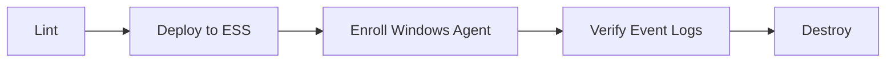

# GitHub Action Workflows

## Test

The `Test` workflow consist of multiple jobs that verify the `winlog` policies install
and produce data.

- Lint - ensures that all [generated](../generate) content in the repo is up-to-date and that
the Terraform files are formatted.
- Deploy - [deploys](../deploy) a Fleet agent policy containing the `winlog` package policies.
- Enroll Windows Agent - Launches a Windows host, installs Elastic Agent, and enrolls it
with Fleet such that our managed Agent policy is applied when it launches.
- Verify Event Logs - After the Windows Agent has run for a brief period then it
queries the data streams that should contain Windows event log data to ensure that
data was properly ingested (it checks each of 
`logs-winlog.{security,windows-powershell,powershell-operational}-*`).
- Destroy - The ESS cluster is deleted.